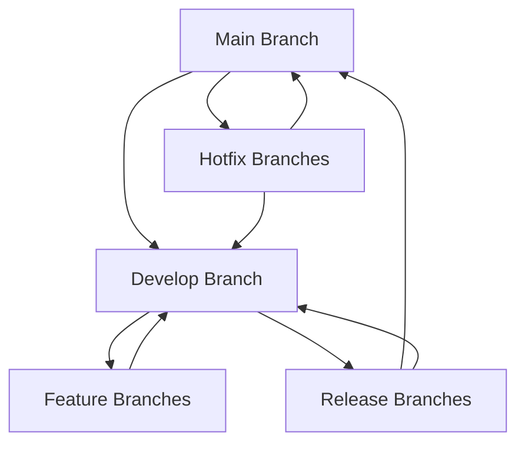

# M.A.S.H. Repository Structure Guide
## GitHub Organization and Repository Architecture

### Project Information
- **Organization**: PP-Namias
- **Project**: M.A.S.H. (Mushroom Automation with Smart Hydro-environment using IoT and AI for Sustainable Harvest)
- **Date**: October 1, 2025
- **Team**: BSCS-4B Development Team

---

## 1. GitHub Organization Structure

### Main Organization: `PP-Namias`
**Organization Description**: 
"Official GitHub organization for M.A.S.H. (Mushroom Automation with Smart Hydro-environment using IoT and AI for Sustainable Harvest) - An integrated IoT and AI-driven platform for automated oyster mushroom cultivation with e-commerce capabilities."

---

## 2. Repository Architecture

The M.A.S.H. project will be organized into **6 separate repositories** to maintain clean separation of concerns, enable independent development, and facilitate deployment:

### 2.1 Backend API Repository

**Repository Name**: `MASH-Backend-API`

**Repository Title**: "M.A.S.H. Backend API - NestJS Microservices"

**Description**: 
```
Core backend API for the M.A.S.H. system built with NestJS and TypeScript. Provides RESTful APIs, real-time WebSocket communication, JWT authentication, and database management with Prisma ORM. Handles user management, device communication, sensor data processing, and e-commerce operations.

🚀 Features:
• RESTful API with Swagger documentation
• Real-time WebSocket communication
• JWT-based authentication & authorization
• MQTT broker for IoT device communication
• PostgreSQL with Prisma ORM
• Role-based access control (RBAC)
• Payment gateway integration
• Docker containerization ready

🏗️ Tech Stack: NestJS, TypeScript, Prisma, PostgreSQL, MQTT, Redis, Docker
```

**Topics**: `nestjs`, `typescript`, `iot`, `mqtt`, `postgresql`, `prisma`, `websocket`, `agriculture`, `mushroom-farming`, `smart-farming`

---

### 2.2 Mobile Application Repository

**Repository Name**: `MASH-Grower-Mobile`

**Repository Title**: "M.A.S.H. Grower Mobile App - Flutter Application"

**Description**:
```
Cross-platform mobile application for mushroom growers built with Flutter. Provides real-time environmental monitoring, cultivation management, device control, and direct market access through integrated e-commerce features.

📱 Features:
• Real-time sensor data dashboard (Temperature, Humidity, CO₂)
• Historical data visualization with interactive charts
• Push notifications for critical alerts
• Remote IoT device control
• Cultivation cycle tracking and photo documentation
• Offline-first architecture with automatic sync
• Biometric authentication support
• Multi-language support (English, Filipino)

🛠️ Tech Stack: Flutter, Dart, SQLite, Firebase, Provider/Bloc, Charts
```

**Topics**: `flutter`, `dart`, `mobile-app`, `iot-monitoring`, `agriculture`, `real-time-data`, `offline-first`, `cross-platform`, `mushroom-cultivation`

---

### 2.3 E-commerce Web Platform Repository

**Repository Name**: `MASH-Ecommerce-Web`

**Repository Title**: "M.A.S.H. E-commerce Platform - Next.js Web Application"

**Description**:
```
Comprehensive e-commerce web platform built with Next.js featuring dual portals for buyers and sellers. Connects mushroom growers directly with consumers, eliminating middlemen and maximizing farmer profits.

🛒 Features:
• Dual-portal architecture (Consumer + Seller)
• Product catalog with advanced search and filtering
• Secure shopping cart and checkout process
• Multiple payment gateways (PayPal, Stripe, GCash)
• Order tracking and management system
• Seller dashboard with analytics and inventory management
• Product reviews and ratings system
• Responsive design for all devices

⚡ Tech Stack: Next.js, TypeScript, React, Tailwind CSS, Stripe API, PWA
```

**Topics**: `nextjs`, `react`, `typescript`, `ecommerce`, `marketplace`, `agriculture`, `mushroom-sales`, `pwa`, `responsive`, `payment-integration`

---

### 2.4 Admin Dashboard Repository

**Repository Name**: `MASH-Admin-Dashboard`

**Repository Title**: "M.A.S.H. Admin Dashboard - System Management Portal"

**Description**:
```
Comprehensive administrative dashboard built with Next.js for managing the entire M.A.S.H. ecosystem. Provides system-wide oversight, user management, device monitoring, and content management capabilities.

🔧 Admin Features:
• User management with role-based permissions
• IoT device fleet management and monitoring
• Real-time system analytics and reporting
• Content Management System (CMS)
• Platform-wide performance metrics
• Security audit logs and monitoring
• Automated alert management
• System configuration controls

📊 Tech Stack: Next.js, TypeScript, React, Chart.js, Material-UI, WebSocket
```

**Topics**: `nextjs`, `admin-dashboard`, `cms`, `iot-management`, `analytics`, `system-monitoring`, `user-management`, `typescript`

---

### 2.5 IoT Device Software Repository

**Repository Name**: `MASH-IoT-Device`

**Repository Title**: "M.A.S.H. IoT Device Software - Raspberry Pi Controller"

**Description**:
```
Python-based IoT software for Raspberry Pi 3 Model B controller managing environmental sensors, actuators, and LCD display for automated mushroom cultivation systems.

🔌 Hardware Features:
• Multi-sensor integration (Temperature, Humidity, CO₂)
• 20x4 LCD display with real-time status
• Actuator control (fans, humidifiers, lighting)
• MQTT communication with cloud backend
• Offline data logging with SQLite
• WiFi connectivity management
• Automatic synchronization when online
• Error handling and recovery mechanisms

🐍 Tech Stack: Python, MQTT, SQLite, GPIO, I2C, LCD drivers, Threading
```

**Topics**: `raspberry-pi`, `iot`, `python`, `mqtt`, `sensors`, `automation`, `agriculture`, `environmental-control`, `sqlite`, `gpio`

---

### 2.6 Documentation Repository

**Repository Name**: `MASH-Documentation`

**Repository Title**: "M.A.S.H. Project Documentation - Complete Project Guide"

**Description**:
```
Comprehensive documentation repository for the M.A.S.H. project including technical specifications, API documentation, user guides, installation instructions, and research materials.

📚 Documentation Includes:
• Project proposal and feasibility studies
• Technical specifications and architecture diagrams
• API documentation and integration guides
• Hardware setup and installation instructions
• User manuals for all applications
• Development and deployment guides
• Research references and stakeholder interviews
• Budget breakdown and project timeline

📖 Contents: Markdown documentation, diagrams, user guides, API specs
```

**Topics**: `documentation`, `api-docs`, `user-guide`, `technical-specs`, `agriculture-research`, `iot-documentation`, `project-management`

---

## 3. Repository Configuration Standards

### 3.1 Common Repository Settings

#### Branch Protection Rules
- **Main Branch**: Protected, requires pull request reviews
- **Develop Branch**: Integration branch for ongoing development
- **Feature Branches**: Named as `feature/description-of-feature`
- **Release Branches**: Named as `release/v1.0.0`
- **Hotfix Branches**: Named as `hotfix/critical-fix-description`

#### Required Files for Each Repository
```
├── README.md                 # Project overview and setup instructions
├── CONTRIBUTING.md           # Contribution guidelines
├── LICENSE                   # MIT or appropriate license
├── .gitignore               # Technology-specific gitignore
├── .github/
│   ├── workflows/           # GitHub Actions CI/CD
│   ├── ISSUE_TEMPLATE/      # Issue templates
│   └── PULL_REQUEST_TEMPLATE.md
├── docs/                    # Additional documentation
├── scripts/                 # Automation scripts
└── [Technology-specific files]
```

#### GitHub Actions Workflows
Each repository will include:
- **Continuous Integration**: Automated testing on pull requests
- **Continuous Deployment**: Automated deployment to staging/production
- **Code Quality**: ESLint, Prettier, security scanning
- **Dependency Updates**: Automated dependency management

### 3.2 Repository-Specific Configurations

#### Backend API (`MASH-Backend-API`)
```yaml
Languages: TypeScript (85%), JavaScript (10%), Dockerfile (5%)
Environment: Node.js 18+, PostgreSQL, Redis
CI/CD: Jest testing, Docker build, AWS deployment
```

#### Mobile App (`MASH-Grower-Mobile`)
```yaml
Languages: Dart (95%), Swift (3%), Kotlin (2%)
Environment: Flutter 3.0+, Android SDK, iOS SDK
CI/CD: Flutter test, APK/IPA build, Play Store/App Store deployment
```

#### E-commerce Web (`MASH-Ecommerce-Web`)
```yaml
Languages: TypeScript (80%), JavaScript (15%), CSS (5%)
Environment: Node.js 18+, Next.js 13+
CI/CD: Jest/Cypress testing, Vercel deployment
```

#### Admin Dashboard (`MASH-Admin-Dashboard`)
```yaml
Languages: TypeScript (80%), JavaScript (15%), CSS (5%)
Environment: Node.js 18+, Next.js 13+
CI/CD: Jest/Cypress testing, Vercel deployment
```

#### IoT Device (`MASH-IoT-Device`)
```yaml
Languages: Python (95%), Shell (5%)
Environment: Python 3.9+, Raspberry Pi OS
CI/CD: PyTest, Raspberry Pi deployment scripts
```

#### Documentation (`MASH-Documentation`)
```yaml
Languages: Markdown (90%), HTML (10%)
Environment: Static site generator (GitBook/MkDocs)
CI/CD: Documentation build and deployment
```

---

## 4. Development Workflow

### 4.1 Git Flow Strategy



### 4.2 Release Management

#### Version Numbering: Semantic Versioning (SemVer)
- **Major**: Breaking changes (1.0.0 → 2.0.0)
- **Minor**: New features, backward compatible (1.0.0 → 1.1.0)
- **Patch**: Bug fixes, backward compatible (1.0.0 → 1.0.1)

#### Release Schedule
- **Alpha Releases**: Monthly during development phase
- **Beta Releases**: Every 2 weeks during testing phase
- **Production Releases**: Monthly after launch
- **Hotfixes**: As needed for critical issues

---

## 5. Collaboration Guidelines

### 5.1 Team Access Permissions

| Repository | Project Manager | Backend Dev | Frontend Dev | Mobile Dev | IoT Dev | Full Stack | DB Admin |
|------------|----------------|-------------|--------------|------------|---------|------------|----------|
| MASH-Backend-API | Admin | Admin | Write | Write | Write | Admin | Admin |
| MASH-Grower-Mobile | Admin | Write | Write | Admin | Write | Write | Write |
| MASH-Ecommerce-Web | Admin | Write | Admin | Write | Write | Admin | Write |
| MASH-Admin-Dashboard | Admin | Write | Admin | Write | Write | Admin | Write |
| MASH-IoT-Device | Admin | Write | Write | Write | Admin | Write | Write |
| MASH-Documentation | Admin | Write | Write | Write | Write | Write | Write |

### 5.2 Code Review Process

#### Pull Request Requirements
- [ ] All tests pass
- [ ] Code coverage maintains >80%
- [ ] Documentation updated
- [ ] At least 1 reviewer approval
- [ ] No merge conflicts
- [ ] Follows coding standards

#### Review Checklist
- [ ] Code functionality and logic correctness
- [ ] Security vulnerability assessment
- [ ] Performance impact evaluation
- [ ] Documentation completeness
- [ ] Test coverage adequacy

---

## 6. Repository Creation Checklist

### Phase 1: Repository Setup (Week 1)
- [ ] Create GitHub organization `PP-Namias`
- [ ] Set up all 6 repositories with proper naming
- [ ] Configure branch protection rules
- [ ] Add team members with appropriate permissions
- [ ] Create issue and PR templates

### Phase 2: Initial Configuration (Week 2)
- [ ] Set up CI/CD pipelines for each repository
- [ ] Configure code quality tools (ESLint, Prettier)
- [ ] Initialize project structures and boilerplate code
- [ ] Create initial documentation and README files
- [ ] Set up development environment instructions

### Phase 3: Integration Setup (Week 3)
- [ ] Configure inter-repository dependencies
- [ ] Set up shared secrets and environment variables
- [ ] Create deployment workflows
- [ ] Establish monitoring and logging
- [ ] Test cross-repository communication

---

## 7. Maintenance and Updates

### 7.1 Regular Maintenance Tasks
- **Weekly**: Dependency updates and security patches
- **Monthly**: Performance optimization and code refactoring
- **Quarterly**: Major version updates and feature releases
- **Annually**: Complete security audit and architecture review

### 7.2 Backup and Recovery
- **Code Repositories**: Automatically backed up by GitHub
- **Documentation**: Synchronized across multiple platforms
- **Recovery Plan**: Documented disaster recovery procedures

---

## 8. Quick Start Commands

### Repository Creation Commands
```bash
# Create new repository (run for each component)
gh repo create PP-Namias/MASH-Backend-API --public --description "Core backend API for M.A.S.H. system"
gh repo create PP-Namias/MASH-Grower-Mobile --public --description "Flutter mobile app for mushroom growers"
gh repo create PP-Namias/MASH-Ecommerce-Web --public --description "E-commerce platform for mushroom marketplace"
gh repo create PP-Namias/MASH-Admin-Dashboard --public --description "Admin dashboard for system management"
gh repo create PP-Namias/MASH-IoT-Device --public --description "Raspberry Pi IoT device software"
gh repo create PP-Namias/MASH-Documentation --public --description "Complete project documentation"
```

### Initial Clone and Setup
```bash
# Clone all repositories
git clone https://github.com/PP-Namias/MASH-Backend-API.git
git clone https://github.com/PP-Namias/MASH-Grower-Mobile.git
git clone https://github.com/PP-Namias/MASH-Ecommerce-Web.git
git clone https://github.com/PP-Namias/MASH-Admin-Dashboard.git
git clone https://github.com/PP-Namias/MASH-IoT-Device.git
git clone https://github.com/PP-Namias/MASH-Documentation.git
```

---

## 9. Contact and Support

### Repository Maintainers
- **Project Manager**: Kevin A. Llanes (@kevin-llanes)
- **Backend Lead**: Jhon Keneth Ryan B. Namias (@namias-backend)
- **Frontend Lead**: Ma. Catherine H. Bae (@catherine-frontend)
- **Mobile Lead**: Irheil Mae S. Antang (@irheil-mobile)
- **IoT Lead**: Jin Harold A. Failana (@jin-iot)
- **Full Stack**: Ronan Renz T. Valencia (@ronan-fullstack)
- **Database Admin**: Emmanuel L. Pabua (@emmanuel-db)

### Support Channels
- **GitHub Issues**: Repository-specific issues and feature requests
- **Team Discord**: Daily communication and quick questions
- **Weekly Meetings**: Progress updates and planning sessions
- **Documentation**: Comprehensive guides and troubleshooting

---

**Document Version**: 1.0  
**Last Updated**: October 1, 2025  
**Next Review**: October 8, 2025  
**Approved By**: Kevin A. Llanes, Project Manager